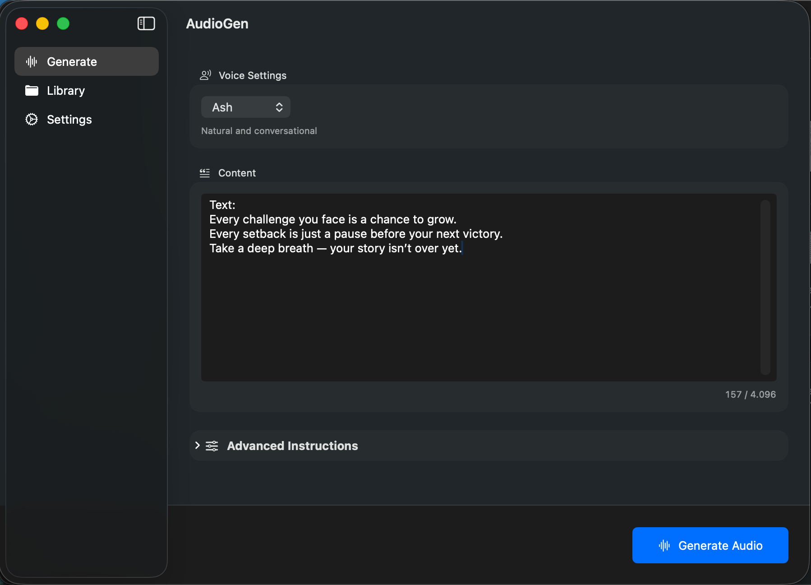
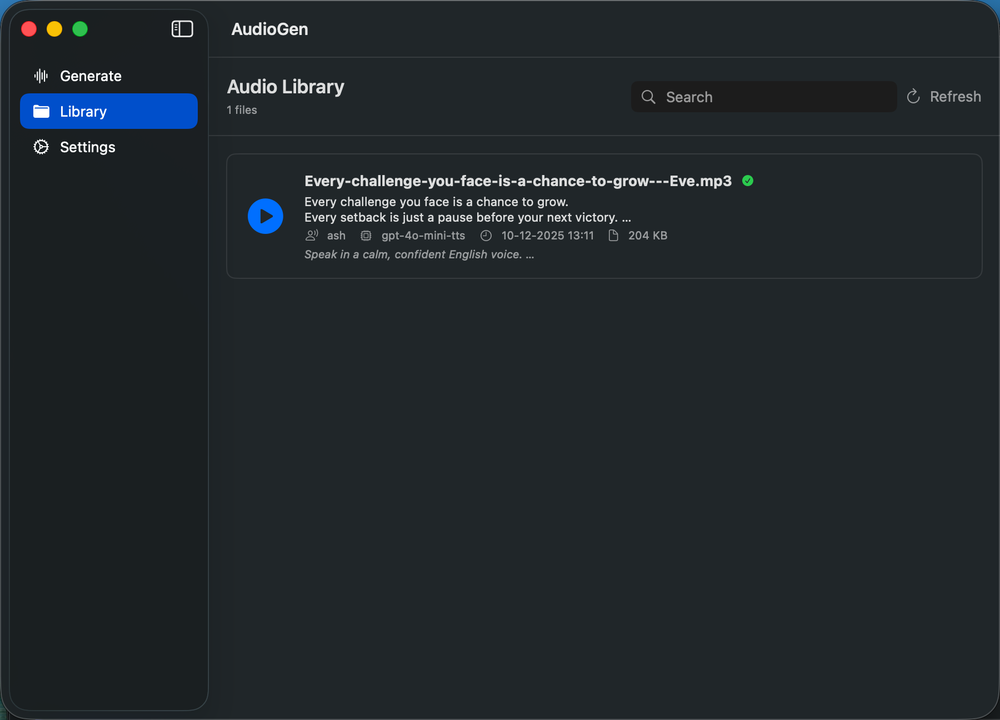

# AudioGen

A native macOS application for generating audio from text using OpenAI's Text-to-Speech API. AudioGen provides an intuitive SwiftUI interface that connects directly to OpenAI for high-quality audio generation.

## Features

- 🎙️ **Voice Selection** - Choose from multiple OpenAI TTS voices (Alloy, Echo, Fable, Onyx, Nova, Shimmer)
- 📝 **Text Input** - Convert up to 4,096 characters to audio
- 🎨 **Smart Instructions** - Add tone and style preferences (processed via GPT-4o-mini)
- 📚 **Audio Library** - Browse, play, and manage generated audio files
- ⚡ **Direct API Integration** - No local server required
- 💾 **Local Storage** - Automatically saves generated audio and metadata
- 🔒 **Secure** - API keys are stored securely in the macOS Keychain

## Screenshots

| Main Interface | Audio Library |
|:---:|:---:|
|  |  |

## Prerequisites

- macOS 13.0 or later
- OpenAI API Key

## Installation

1. Clone the repository
2. Open `AudioGen.xcodeproj` in Xcode
3. Build and run (⌘R)

## Setup

### 1. Configure API Key

On first launch, go to **Settings** (gear icon) and enter your OpenAI API Key. The key is stored securely in your system Keychain.

### 2. Generate Audio

1. Enter the text you want to convert.
2. (Optional) Add instructions for style or tone (e.g., "Speak cheerfully").
3. Select a voice.
4. Click **Generate Audio**.

## Architecture

- **Frontend**: SwiftUI (MVVM)
- **Backend**: Direct integration with OpenAI API
- **Storage**: Local file system for audio and JSON metadata

## Author

**Guillermo Vertel**

## License

MIT License
